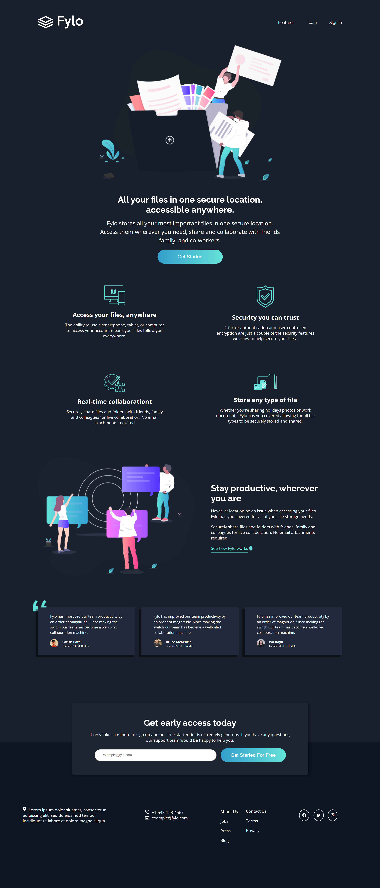
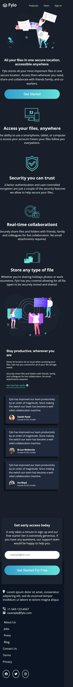

# Fylo-dark-theme-landing-page-master
------
# Frontend Mentor - Fylo dark theme landing page section solution

This is a solution to the [Fylo dark theme landing page section solution challenge on Frontend Mentor](https://www.frontendmentor.io/challenges/fylo-dark-theme-landing-page). Frontend Mentor challenges help you improve your coding skills by building realistic projects. 

## Table of contents

- [Overview](#overview)
  - [The challenge](#the-challenge)
  - [Screenshot](#screenshot)
  - [Links](#links)
- [My process](#my-process)
  - [Built with](#built-with)
  - [Continued development](#continued-development)
- [Author](#author)
- [Acknowledgments](#acknowledgments)

## Overview

### The challenge

Users should be able to:

- View the optimal layout for the page depending on their device's screen size
- See hover states for all interactive elements on the page

### Screenshot

---------------------------------

### Links

- Solution URL: [https://github.com/AmanGupta1703/Fylo-Dark-Theme-Landing-Page]
- Live Site URL: []

## My process

### Built with

- Semantic HTML5 markup
- CSS custom properties
- Flexbox

### Continued development
1) FlexBox 
2) Responsive Design

## Author

- Website - [Fylo-dark-theme-landing-page](https://github.com/AmanGupta1703/Fylo-Dark-Theme-Landing-Page/)
- Frontend Mentor - [@AmanGupta1703](https://www.frontendmentor.io/profile/AmanGupta1703)
